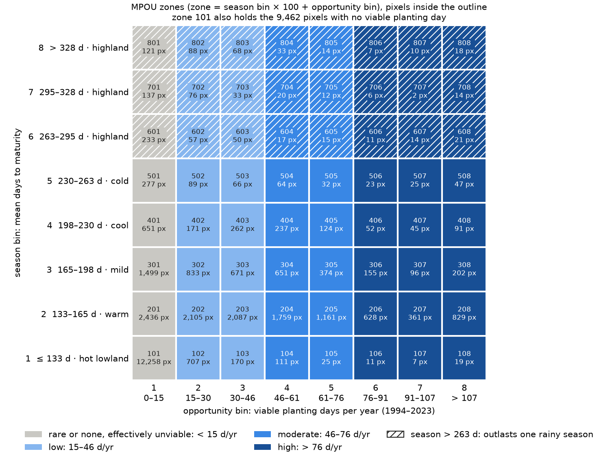

# MPOU maps: Sub-Saharan Africa, ERA5 1994–2024

These are the published Maize Planting Opportunity Units (MPOU) maps. They were made with MPOU and
`examples/era5_sub_saharan_africa.py`, using the default maize parameters. The top-level README explains
how to reproduce them.

| File | dtype | Meaning |
|---|---|---|
| `planting_opportunity_days.tif` | uint16 | viable planting days from 1994-01-01 to 2023-12-31 |
| `season_length.tif` | float64 | mean days to maturity over all viable days from 1994-01-01 to 2024-12-31; NaN if none |
| `zones_nbins=8.tif` | uint16 | zones `season_bin * 100 + opportunity_bin` with 8 bins; nodata 0 |

- **Grid:** 249 × 333 pixels at 0.25°, EPSG:4326, from 25.375° W to 57.875° E and from 34.875° S to
  27.375° N. This is the bounding box of the ISRIC Sub-Saharan Africa outline
  (`AfSP012Qry_SubSaharanAfrica.shp`).
- **Weather:** ERA5 daily statistics from the Copernicus Climate Data Store
  ([derived-era5-single-levels-daily-statistics](https://cds.climate.copernicus.eu/datasets/derived-era5-single-levels-daily-statistics)).
  The inputs are `2m_temperature` (daily mean, °C) and `total_precipitation` (daily sum, mm), from
  1994-01-01 to 2024-12-31.
- **Parameters:** every file stores the MPOU parameters and dates as GeoTIFF tags. Run `gdalinfo` on a
  file to see them. The zones file also stores its bin settings. The `enddate` tag, 2024-12-01, is the
  date of the last monthly ERA5 file, so the data run to 2024-12-31.
- **Renamed from CSU:** these maps continue the earlier Crop Suitability Units (CSU) maps, which were never
  published. The top-level README has a table of the renamed files.

## Zone legend

Zone code = season bin × 100 + opportunity bin; for example, 203 is season bin 2, opportunity bin 3. Each
bin includes its upper edge but not its lower edge. Bin 1 also takes values below the range, and bin 8 also
takes values above it. Pixel counts are for the 32,488 pixels inside the Sub-Saharan Africa outline. The figure is drawn by `zone_legend` in `report/make_figures.py`. The class
names and the "Reading" columns are rough guides, not part of the model.

**Opportunity bin** (last two digits): viable planting days in the 30 years 1994–2023. Divided by 30, this
is roughly how many days a year planting would have worked, with all planting windows in a year added
together. It is a 30-year average, so 15 d/yr can mean 30 days every other year.

| Bin | Total days | ≈ Days per year | Class | Reading | Pixels |
|---|---|---|---|---|---|
| 1 | 0 – 456.5 | 0 – 15.2 | rare or none | effectively unviable: no window, or under about 2 weeks a year | 17,612 (9,569 at 0) |
| 2 | 456.5 – 913 | 15.2 – 30.4 | low | a short window of about 2–4 weeks | 4,126 |
| 3 | 913 – 1,369.5 | 30.4 – 45.7 | low | a window of about 1–1.5 months | 3,407 |
| 4 | 1,369.5 – 1,826 | 45.7 – 60.9 | moderate | a window of about 1.5–2 months | 2,892 |
| 5 | 1,826 – 2,282.5 | 60.9 – 76.1 | moderate | about 2–2.5 months: a long window, or two seasons | 1,757 |
| 6 | 2,282.5 – 2,739 | 76.1 – 91.3 | high | about 2.5–3 months: long rains or two seasons | 893 |
| 7 | 2,739 – 3,195.5 | 91.3 – 106.5 | high | about 3–3.5 months | 560 |
| 8 | > 3,195.5 | > 106.5 | high | more than about 3.5 months | 1,241 |

**Season bin** (first digit): mean days from planting to maturity for the fixed 2400 GDD variety. With one
variety everywhere this is mostly a temperature gradient. The temperature column is approximate: it uses
T ≈ 8 + 2400 / season length, which tracks the mean-temperature map closely (r = 0.955).

| Bin | Season length (days) | ≈ Months | ≈ Mean temperature (°C) | Reading | Pixels |
|---|---|---|---|---|---|
| 1 | ≤ 132.5, or never viable | ≤ 4.4 | > 26.1 | short season, hot lowland | 13,308 (9,462 never viable) |
| 2 | 132.5 – 165 | 4.4 – 5.4 | 26.1 – 22.5 | warm lowland to low mid-altitude | 11,366 |
| 3 | 165 – 197.5 | 5.4 – 6.5 | 22.5 – 20.2 | mild, mid-altitude | 4,481 |
| 4 | 197.5 – 230 | 6.5 – 7.6 | 20.2 – 18.4 | cool, upper mid-altitude | 1,633 |
| 5 | 230 – 262.5 | 7.6 – 8.6 | 18.4 – 17.1 | cold; longer than most single rainy seasons | 623 |
| 6 | 262.5 – 295 | 8.6 – 9.7 | 17.1 – 16.1 | highland; the variety needs most of a year to mature (hatched in the figure) | 418 |
| 7 | 295 – 327.5 | 9.7 – 10.8 | 16.1 – 15.3 | highland, as bin 6 | 300 |
| 8 | > 327.5 | > 10.8 | < 15.3 | highland, as bin 6 | 359 |

To read a zone, combine its two bins. For example, 204 is a warm, roughly 5-month season with a planting
window of about 1.5–2 months a year. 806 is a highland pixel that is often plantable, but the crop takes
nearly a year to mature.

**Zone 101** (12,258 px, 38 %) holds the pixels with no viable planting day (they have no season length)
as well as those in the lowest bin of both layers.

## Licence

The maps are licensed under [CC BY 4.0](https://creativecommons.org/licenses/by/4.0/). The MPOU code is
MIT. When you use the maps, cite MPOU (see "How to cite" in the top-level README) and include:

> Contains modified Copernicus Climate Change Service information [1994–2024]. Neither the European
> Commission nor ECMWF is responsible for any use that may be made of the Copernicus information or data
> it contains.
