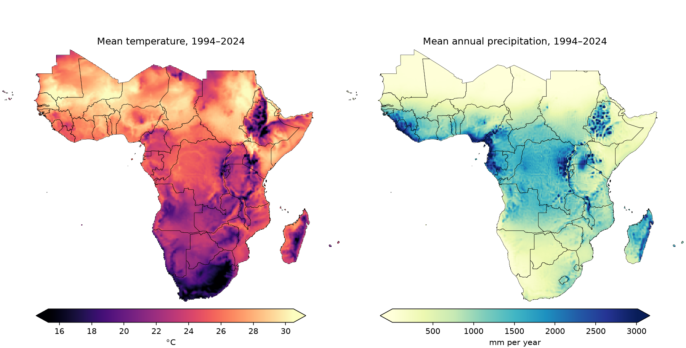
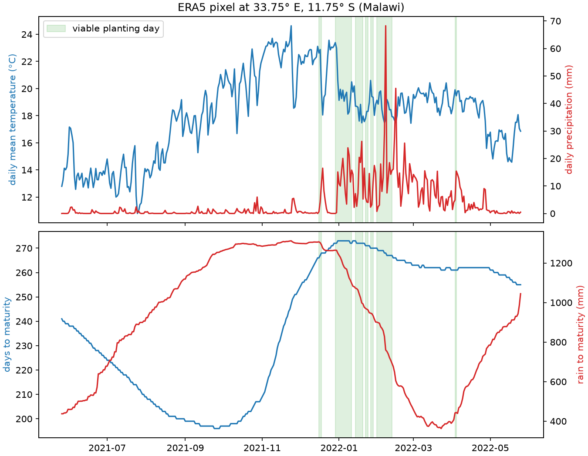
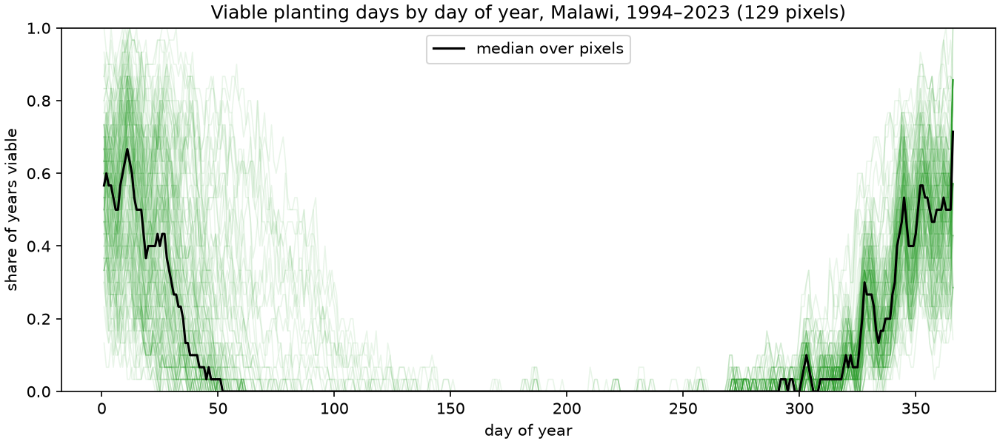
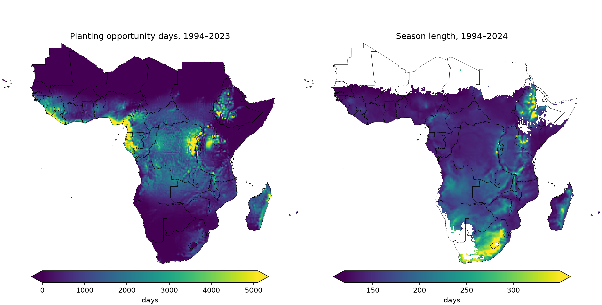
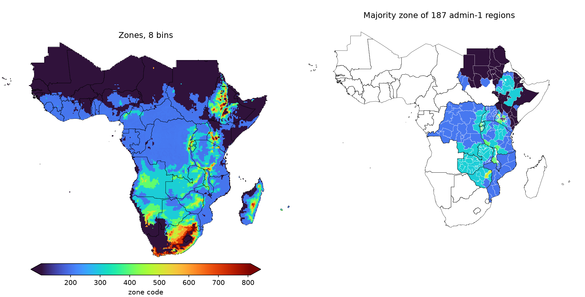
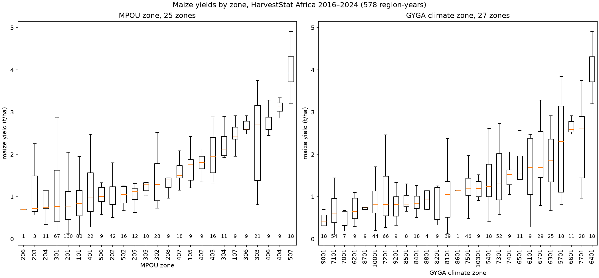

# Maize Planting Opportunity Units (MPOU): method, maps and evaluation

MPOU v1.0.0 ([doi:10.5281/zenodo.22710597](https://doi.org/10.5281/zenodo.22710597)). Every figure in this
report is drawn by code in this folder; section 7 gives the commands.

## Summary

MPOU zones land by how often daily weather let maize planted on a given day reach maturity, and by the
typical season length. For Sub-Saharan Africa it was computed from ERA5 daily weather for 1994–2024 at 0.25°.
Each of the two layers was split into 8 bins, giving up to 64 zones. The zones were compared with the GYGA
climate zones using HarvestStat Africa maize yields: 578 region-years in 100 admin-1 regions of 7 countries.
The two schemes group yields comparably: MPOU does worse among low-yield regions and better among
medium-yield regions. Unlike GYGA, MPOU is crop-specific and its parameters can be tuned.

## 1. Background

MPOU is a crop-specific zoning framework built from long-term daily weather. It was developed as a
crop-specific alternative to technology extrapolation domains (TEDs), and is meant as the first layer of a
hierarchical approach to understanding crop productivity in Sub-Saharan Africa. The current version is
for maize.

MPOU measures how often, historically, maize planted at a location on a given day would have reached
maturity. Extending it to another crop starts with that crop's key failure. For maize the key failure is a
dry spell at pollination (flowering): if no rain falls when the maize tassels, the grain fails.

MPOU was first called Crop Suitability Units (CSU). It was renamed because "suitability" has a specific FAO
meaning that this method does not follow. The method, zone codes and pixel values are unchanged; the
top-level README has a table of the renamed layers, files and functions.

## 2. Data

Daily weather comes from the Copernicus Climate Data Store dataset
[derived-era5-single-levels-daily-statistics](https://cds.climate.copernicus.eu/datasets/derived-era5-single-levels-daily-statistics):

- `2m_temperature`, daily mean, converted from K to °C;
- `total_precipitation`, daily sum, converted from m to mm.

The data are at 0.25° and cover 1994-01-01 to 2024-12-31 (11,323 days). They are clipped to the bounding
box of the ISRIC Sub-Saharan Africa outline (`AfSP012Qry_SubSaharanAfrica.shp`): 249 × 333 pixels, from
25.375° W to 57.875° E and from 34.875° S to 27.375° N. The maps in this report show the 32,488 pixels whose
centre lies inside the outline.



*Figure 1. ERA5 mean daily temperature and mean annual precipitation, 1994–2024.*

## 3. Method

### 3.1 Crop parameters

The parameters describe a medium-maturity maize. They are the defaults of `mpou.viable_planting_days`.

| Parameter | Value | MPOU argument |
|---|---|---|
| Base temperature for growing degree days (GDD) | 8 °C | `t_base` |
| GDD to pollination ([CIMMYT CAH219](https://maizecatalog.cimmyt.org/tech/CAH219)) | 842 °C·day | `required_gdd_for_pollination` |
| GDD to maturity | 2400 °C·day | `required_gdd_for_maturity` |
| Maximum tolerable temperature | 45 °C | `max_tolerable_temp` |
| Minimum tolerable temperature | 0 °C | `min_tolerable_temp` |
| Maximum time to maturity | 500 days | `max_duration` |
| Minimum rain from sowing to maturity | 450 mm | `min_total_prec_till_maturity` |
| Dry run at pollination must be shorter than | 5 days | `max_consecutive_dry_days` |
| A day is dry below | 1 mm | `dryspell_threshold` |
| Germination window | 3 days | `days_to_germination` |
| Rain in the germination window must exceed | 20 mm | `min_total_prec_for_germination` |

### 3.2 Viable planting days

For every pixel and every day *t*, MPOU asks: would maize planted on day *t* have germinated and reached
maturity? Day *t* is a **viable planting day** when all of these hold:

1. **Germination:** rain on days *t*+1, *t*+2, *t*+3 totals more than 20 mm.
2. **Maturity**, counted from *s* = *t*+3, the end of germination:
   - GDD, the running sum of max(*T* − 8 °C, 0), exceed 2400 within 500 days;
   - no day before that reaches 45 °C or drops to 0 °C;
   - rain on days *s*+1 … *s*+(days to maturity) totals at least 450 mm.
3. **Pollination:** the run of dry days (< 1 mm) that starts on the day after 842 GDD are exceeded is
   shorter than 5 days.

Days to maturity are counted from the planting day until the GDD sum exceeds 2400. When a temperature limit
is hit first, or the series ends first, the season never matures.

An earlier version of the method had no germination or pollination test. Adding them, with the 842 GDD
pollination point, moved the viable planting period in Malawi to mid-November – mid-February, in line with
the local crop calendar.

### 3.3 Worked example: one pixel in Malawi

Figure 2 follows one ERA5 pixel for a year of planting days from 2021-05-26. The pixel is located at 33.75° E, 11.75° S.



*Figure 2. One Malawi pixel, planting days 2021-05-26 to 2022-05-25. Top: daily mean temperature and daily
precipitation. Bottom: days to maturity counted from each planting day, and rain from the day after planting
to maturity. Green shading marks viable planting days, which also need the germination and pollination tests
of section 3.2.*

In that year 45 of the 365 planting days are viable: 6 in December, 25 in January, 12 in February and 2 in
early April. The dry season is ruled out by germination, not by the season total: of the 159 days from
26 May to 31 October, 154 would have collected at least 450 mm of rain before maturity, because their
windows reach into the next rainy season, but not one of them has more than 20 mm of rain in the following
three days. Days to maturity is shortest for plantings in late September (196 days), when the coming season
is warmest, and longest at the end of December (273 days).

Figure 3 shows when in the year planting was viable across Malawi. For each pixel inside Malawi, it plots
the share of the 30 years 1994–2023 in which each day of the year was a viable planting day.



*Figure 3. Share of years in which each day of the year was a viable planting day, one line per ERA5 pixel
inside Malawi (HarvestStat Africa boundaries), with the median over pixels. Day 366 occurs only in leap
years.*

The window runs from about day 320 (mid-November) to about day 50 (mid-February) and is empty from March to
October, which matches the maize calendar in Malawi. At the peak in early January the median pixel was
viable in about two years out of three.

### 3.4 The two layers

- **Planting opportunity days:** the number of viable planting days from 1994-01-01 to 2023-12-31, out of
  10,957 days.
- **Season length:** the mean days to maturity over all viable planting days in the full series,
  1994–2024. It is empty (NaN) where no day was viable.



*Figure 4. Planting opportunity days (1994–2023) and season length (1994–2024). Colour scales span the 1st
to 99th percentile inside the outline; the arrows mark values beyond them. White pixels in the season length
map had no viable planting day.*

### 3.5 Zones

Both layers are cut into 8 equal-width bins:

- planting opportunity days from 0 to 3652, a third of the 10,957 days, in steps of 456.5 days;
- season length from 100 to 360 days, in steps of 32.5 days.

A zone code is `season_bin * 100 + opportunity_bin`, with bins numbered from 1. For example, zone 305 has
season bin 3 (165–197.5 days) and opportunity bin 5 (1826–2282.5 days). Eight bins were chosen because
the number of zones they give in the evaluation regions (25) is close to the number of GYGA climate zones
there (27).

In v1.0.0, a value above the top bin edge lands in bin 1, not bin 8. Inside the outline this affects 909
pixels with more than 3652 opportunity days and 187 pixels with a season longer than 360 days. Pixels with
no viable day get zone 101.



*Figure 5. Left: MPOU zones, 8 bins. Right: the majority zone of each admin-1 region in the 12 candidate
countries of the evaluation (section 5).*

## 4. Results

Inside the Sub-Saharan Africa outline (32,488 pixels):

- 22,919 pixels (71%) had at least one viable planting day before 2024. Among them, the median is 823
  planting opportunity days (5th–95th percentile: 12–3,306), and the maximum is 9,532.
- Season length has a median of 149 days (5th–95th percentile: 125–259), ranging from 109 to 495 days.
- All 64 zones occur. Zone 101 covers 12,344 pixels (38%). It holds the pixels with no viable day, as well
  as those in the lowest bin of both layers.

The two layers pick out different things (Figure 4). Planting opportunity days are highest along the Guinea
and Cameroon coasts and around the Rift Valley lakes, moderate across the Congo basin, and near zero over
the Sahara, the Horn of Africa, and the Kalahari and Namib. Season length is longest where it is cool: the
Ethiopian highlands, the south coast of South Africa, the Angolan highlands and eastern Madagascar, where
maize needs longer to accumulate 2400 GDD. The zone map (Figure 5) therefore separates warm, wet areas with
many planting opportunities from cool areas where one season takes most of a year.

## 5. Evaluation

The zones were evaluated against maize yields from HarvestStat Africa
([doi:10.5061/dryad.vq83bk42w](https://doi.org/10.5061/dryad.vq83bk42w)), and compared with the
[GYGA climate zones](https://yieldgap-test.containers.wur.nl/web/guest/climate-zones).

1. **Yields.** Maize area and production were summed per country, admin-1 region and planting year.
   Yield is production divided by area. Region-years with no area and planting years before 2016 were
   dropped.
2. **Zones per region.** Each admin-1 region of the HarvestStat boundaries got its majority zone: the most
   common value among raster pixels whose centre lies in the region. This was done both for the MPOU zones
   and for the GYGA climate zones.
3. **Countries.** The candidates were Burundi, DR Congo, Ethiopia, Kenya, Malawi, Mozambique, Rwanda,
   Sudan, Tanzania, Uganda, Zambia and Zimbabwe. In these, 187 admin-1 regions received a zone
   (Figure 5, right). Only 100 of those regions had 2016–2024 maize yields, all in DR Congo, Kenya, Malawi,
   Mozambique, Rwanda, Zambia and Zimbabwe. Together they give 578 region-years.



*Figure 6. Maize yields of 578 region-years (HarvestStat Africa, 2016–2024), grouped by the region's
majority MPOU zone (left) and GYGA climate zone (right). Zones are ordered by median yield; the number under
each box is its count of region-years. Whiskers reach 1.5 times the interquartile range; outliers are not
drawn.*

The two schemes are comparable at grouping regions into zones with similar yields. MPOU does worse than
GYGA among low-yield regions and better among medium-yield regions. MPOU's advantages over GYGA are that its
zones are specific to one crop and its parameters can be tuned. How to build one set of zones for several
crops remains open.

## 6. Limitations and next steps

- MPOU uses weather only: no soil, slope or management. At 0.25°, one pixel is about 28 km across.
- Lake and high-altitude areas show many planting opportunity days, and some pixels have very long seasons
  (more than 200 days to maturity). Both need a closer look.
- v1.0.0 keeps the numerics of the original code, including the binning overflow (section 3.5) and the
  other quirks listed in the README. Fixes are planned for v1.1.0.
- Next steps under consideration:
  - add soil (for example SoilGrids at 250 m), soil organic carbon and slope from a DEM;
  - refine the viability tests;
  - build zones for several maturity classes (GDD requirements) and combine them.

## 7. Reproduce the figures

The maps come from `maps/era5_sub_saharan_africa/`; see "Reproduce the published maps" in the top-level
README. The ERA5 figures need a cluster run, and all figures are then drawn on a laptop.

1. On the cluster, from the repository root, with the environment and variables of the README run-book:
   ```
   .venv/bin/python -m report.era5_figure_data "$CATALOG" "$REGION" report/data
   ```
   This writes `mean_temperature.tif`, `mean_annual_precipitation.tif`,
   `malawi_viable_share_by_day_of_year.tif` and `malawi_pixel.csv` to `report/data/`.
2. Locally, from the repository root, with `report/data/` copied over:
   ```
   .venv/bin/pip install -r examples/requirements.txt -r report/requirements.txt
   .venv/bin/python report/make_figures.py REGION HVSTAT_CSV HVSTAT_GPKG GYGA_TIF
   ```
   The inputs are:
   - `REGION`: `AfSP012Qry_SubSaharanAfrica.shp`;
   - `HVSTAT_CSV` and `HVSTAT_GPKG`: `hvstat_africa_data_v1.0.csv` and `hvstat_africa_boundary_v1.0.gpkg`
     from HarvestStat Africa;
   - `GYGA_TIF`: the GYGA climate zone raster `GYGA_ED.tif`.

   The script writes the six figures to `report/figures/`. It also prints the evaluation counts: 187 regions
   with a zone, 100 with yields, 578 region-years, 25 MPOU zones and 27 GYGA zones.

## Data sources

- ERA5 daily statistics, Copernicus Climate Data Store. Contains modified Copernicus Climate Change Service
  information [1994–2024].
- HarvestStat Africa v1.0, [doi:10.5061/dryad.vq83bk42w](https://doi.org/10.5061/dryad.vq83bk42w).
- GYGA climate zones, [Global Yield Gap Atlas](https://yieldgap-test.containers.wur.nl/web/guest/climate-zones).
- ISRIC Africa Soil Profiles database, Sub-Saharan Africa outline (`AfSP012Qry_SubSaharanAfrica.shp`).
